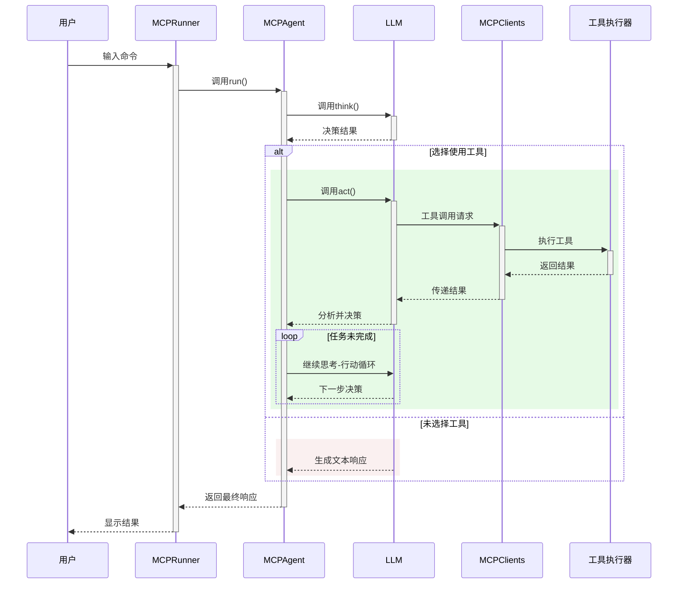

```mermaid
sequenceDiagram
    participant 用户
    participant MCPRunner
    participant MCPAgent
    participant LLM
    participant MCPClients
    participant 工具执行器

    用户->>+MCPRunner: 输入命令
    MCPRunner->>+MCPAgent: 调用run()

    MCPAgent->>+LLM: 调用think()
    LLM-->>-MCPAgent: 决策结果

    alt 选择使用工具
        rect rgb(230, 250, 230)
            MCPAgent->>+LLM: 调用act()
            LLM->>+MCPClients: 工具调用请求
            MCPClients->>+工具执行器: 执行工具
            工具执行器-->>-MCPClients: 返回结果
            MCPClients-->>-LLM: 传递结果
            LLM-->>-MCPAgent: 分析并决策

            loop 任务未完成
                MCPAgent->>LLM: 继续思考-行动循环
                LLM-->>MCPAgent: 下一步决策
            end
        end
    else 未选择工具
        rect rgb(250, 240, 240)
            LLM-->>MCPAgent: 生成文本响应
        end
    end

    MCPAgent-->>-MCPRunner: 返回最终响应
    MCPRunner-->>-用户: 显示结果
```
