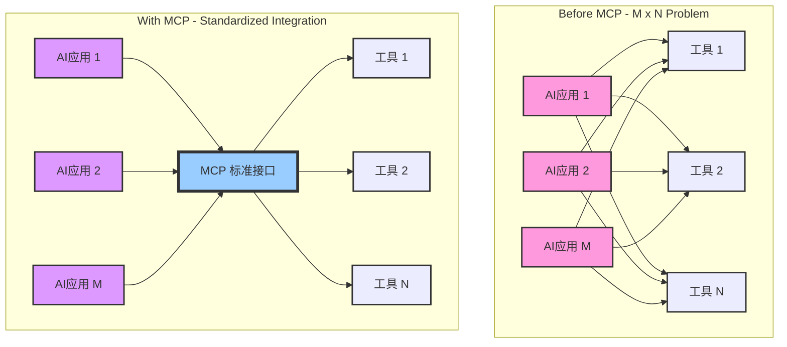
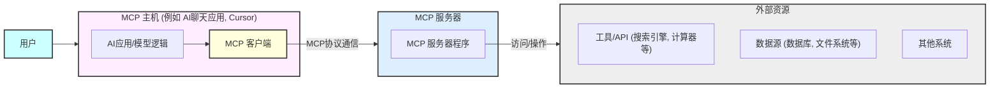
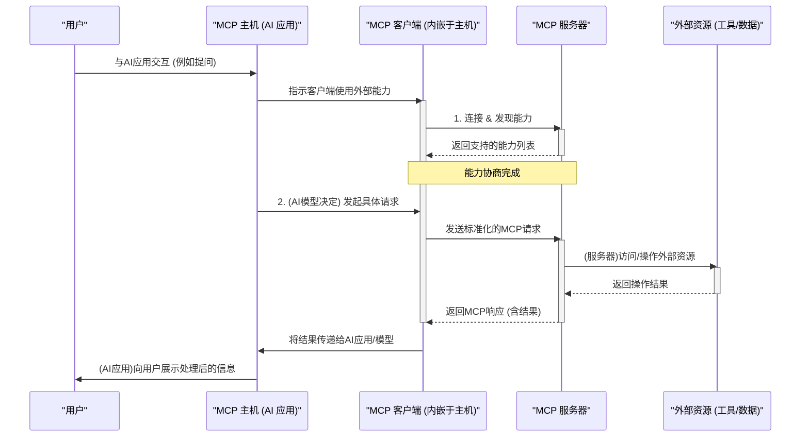
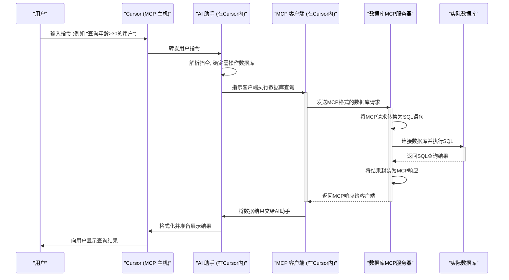

# 理解MCP协议：连接AI与现实世界的桥梁

随着人工智能，特别是大型语言模型（LLM）的飞速发展，如何让这些聪明的"大脑"更有效地与现实世界的数据和工具互动，成为了一个亟待解决的问题。模型上下文协议（MCP，Model Context Protocol），特别是 Anthropic 公司提出的开放标准，正为此提供了一个富有前景的解决方案。

## MCP协议是什么？为什么我们需要它？

您可以形象地将MCP协议理解为**AI领域里的USB-C接口**。

在过去，如果一个AI应用（比如一个智能聊天机器人或AI助手）想要调用外部的工具（如搜索引擎、计算器、API服务）或访问特定的数据库，开发者往往需要为每一个AI模型和每一个外部工具之间进行定制化的集成开发。这就像早期电脑连接打印机、鼠标、键盘等外设一样，接口五花八门，驱动各不相同，导致了巨大的开发和维护成本。这就是所谓的"M×N问题"——M个AI应用与N个外部工具之间可能需要 M×N 个独立的集成方案。

下图展示了"M×N问题"以及MCP如何简化这一问题：

MCP协议旨在通过标准化这一交互过程，解决上述难题。它的核心目标包括：

- 统一交互标准：为AI应用与外部资源（数据、工具、系统）提供一套通用的"语言"和连接框架。
- 动态发现与使用：让AI应用能够在运行时动态地发现有哪些可用的外部工具及其功能，而不是预先写死。
- 增强上下文感知：通过顺畅接入外部实时数据和专业知识，让AI模型获得更丰富、准确的上下文，从而做出更智能、更有用的响应。
- 提升互操作性：促进不同的AI模型、应用和工具之间的协同工作，构建一个更开放的AI生态系统。
- 简化开发集成：降低开发者将AI能力融入现有工作流和系统中的复杂性。
- 安全可控：提供一种相对安全的方式让AI应用访问外部资源，尤其是在企业环境中访问敏感数据。

## MCP协议如何工作？核心组件解析

MCP协议通常采用经典的**客户端-服务器（Client-Server）**架构：

- MCP主机（MCP Host）：这是用户直接与之交互的AI应用环境。例如，一个AI聊天界面，或者像Cursor这样的AI辅助编程环境。
- MCP客户端（MCP Client）：通常内嵌于MCP主机中。它负责按照MCP协议的规范，与MCP服务器进行通信，包括建立连接、发现服务器提供的能力、发送请求以及接收和处理响应。
- MCP服务器（MCP Server）：这是一个独立的程序或服务，它充当了外部工具、数据源或系统与MCP客户端之间的"桥梁"。它将外部资源的能力（例如，查询数据库、调用某个API）封装起来，并通过MCP协议暴露给客户端。

下图描绘了MCP的核心组件及其关系：

简单的工作流程可以概括为：

- 连接与发现：MCP主机中的客户端启动后，会连接到一个或多个MCP服务器。
- 能力协商：客户端与服务器进行"握手"，了解对方支持的协议版本以及服务器能提供的具体"工具"或"服务"。
- 请求与响应：当AI模型需要使用外部功能时，客户端会向相应的服务器发送符合MCP规范的请求。服务器执行任务后，将结果返回给客户端，客户端再将这些信息反馈给AI模型或用户。

下面是一个简化的MCP工作流程时序图：

## 实例解析：在Cursor中使用MCP操作数据库

让我们通过一个具体的例子来理解MCP的运作方式。假设我们想在AI代码编辑器Cursor中使用MCP协议来操作数据库：

- Cursor作为MCP主机： 在这个场景中，Cursor编辑器本身（或者其集成的AI编程助手）就是MCP主机。用户在这里输入指令，AI模型在这里运行。
- Cursor中需要一个MCP客户端： 为了与外部数据库服务通信，Cursor内部需要运行一个MCP客户端。当用户通过自然语言或特定命令指示AI助手（例如："帮我查询用户表中所有年龄大于30的用户"）时，这个客户端会将这个意图转换成MCP协议定义的标准请求。
- 需要一个专门操作数据库的MCP服务器： 会有一个或多个MCP服务器专门负责与数据库打交道。这个服务器会暴露诸如"执行SQL查询"、"插入数据"、"更新数据"等能力。

关键点：这个MCP服务器自身必须能够直接连接到目标数据库。它需要配置有数据库的连接地址、端口、访问凭证（用户名/密码），并安装了相应的数据库驱动。没有这些，它就无法代表客户端去实际操作数据库。

交互流程：
1. 用户在Cursor中下达指令给AI助手。
2. AI助手通过Cursor内置的MCP客户端，将操作数据库的请求发送给数据库MCP服务器。
3. 数据库MCP服务器接收到请求，解析后连接到实际的数据库，执行相应的SQL语句。
4. 数据库返回结果给MCP服务器。
5. MCP服务器将结果按照MCP协议格式打包，发送回Cursor中的MCP客户端。
6. MCP客户端将结果呈现给AI助手，AI助手再反馈给用户。

以下是在Cursor中使用MCP操作数据库的交互流程示例：

通过这种方式的好处显而易见：
- 解耦：Cursor本身不需要知道如何连接各种不同类型的数据库，也不需要处理SQL方言的差异。这些都由专门的MCP服务器负责。
- 标准化：只要MCP服务器遵循MCP协议，Cursor的客户端就能与之通信，而不用关心服务器背后是MySQL、PostgreSQL还是其他数据库。
- 灵活性与扩展性：如果需要支持一种新的数据库，只需要开发一个新的MCP服务器来封装它即可，Cursor端的改动可能很小。

## 总结

MCP协议为AI应用与外部世界之间架起了一座标准化的桥梁。通过清晰定义的角色（主机、客户端、服务器）和交互流程，它使得AI能够更安全、更便捷、更动态地利用外部数据和工具，从而从单纯的"对话者"转变为能够实际"干活"的智能体。正如我们在Cursor操作数据库的例子中所看到的，MCP服务器作为实际操作的执行者，其直接与被操作资源（如数据库）的连接能力是整个机制得以运转的基础。随着MCP生态的不断发展和完善，我们有理由相信它将极大地推动AI在各行各业的落地应用。

