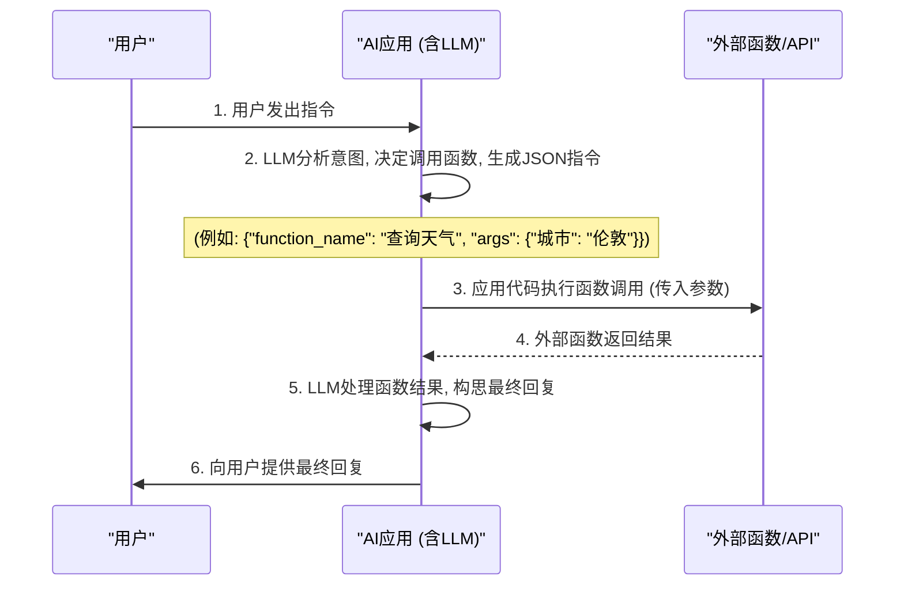
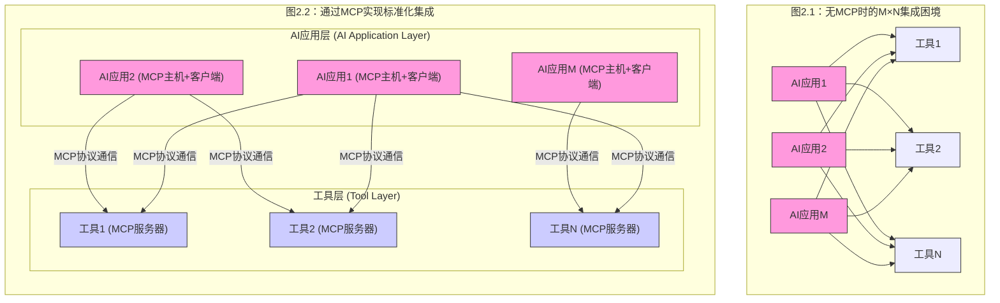
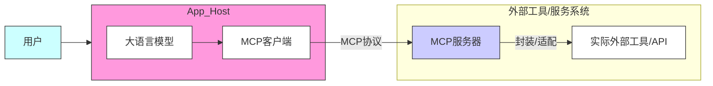

# 从意图到交互：函数调用与MCP如何赋能AI驾驭外部工具

随着大型语言模型（LLM）能力的飞速发展，它们已不再仅仅是文本生成器，而是日益成为能够理解复杂指令、进行推理并与数字世界互动的智能核心。然而，LLM自身的知识截止日期和其固有的局限性，使其必须有效地与外部实时数据、API及各类应用工具相结合，才能真正发挥其潜力。本文将循着我们今日探讨的路径，首先解析LLM与外部工具交互的基础——函数调用（Function Calling），进而深入探讨模型上下文协议（MCP）是如何在这一基础上构建，致力于解决大规模、标准化的AI与工具集成问题。

## 一、函数调用——赋予LLM表达"行动意图"的能力

要让LLM能动地使用外部工具，首先需要一种机制让它能够清晰地表达"我想要做什么"以及"我需要什么参数"。这正是"函数调用"机制的核心所在。

### 什么是函数调用？

函数调用允许LLM在处理用户请求后，不直接生成回复，而是输出一个结构化的数据对象（通常是JSON格式）。这个JSON对象精确地描述了LLM希望调用的一个外部函数或工具的名称，以及它从用户输入中提取或推断出的、执行该函数所必需的参数。重要的是，LLM本身并不执行这个函数；它仅仅是生成调用请求。

### 为何函数调用至关重要？

- **访问实时数据**：LLM的训练数据有截止日期，函数调用使其能查询API获取最新天气、新闻、股价等。
- **执行外部动作**：通过调用相应函数，LLM可以间接实现发送邮件、预订会议、控制智能家居等操作。
- **克服LLM局限**：对于精确计算、特定业务逻辑处理等非其核心强项的任务，可以交由外部专业函数完成。
- **结构化输出**：确保从外部工具获取的信息或执行结果以可预测、机器可读的格式返回。

### 函数调用如何工作？

其典型流程如下（亦可参考下图）：

1. **定义阶段**：开发者向LLM提供一组可用函数的描述，包括函数名、功能说明（帮助LLM判断何时调用）、以及参数列表（参数名、类型、是否必需等）。
2. **请求阶段**：用户向LLM发出指令。
3. **决策阶段**：LLM分析用户意图，判断是否需要以及哪个已定义的函数能更好地满足请求。
4. **生成调用请求**：若LLM决定调用函数，它会生成一个包含函数名和参数的JSON对象。
5. **执行阶段**：外部应用程序（或称为"运行时"、"业务逻辑层"）捕获这个JSON对象，解析并实际执行对应的本地函数或API调用。
6. **结果反馈**：函数执行的结果被送回给LLM。
7. **最终响应**：LLM结合原始请求和函数执行结果，生成一个更全面、更准确的自然语言回复给用户。

**图1：函数调用工作流程示意图**

例如，用户问"伦敦现在天气如何？"，LLM若有get_weather(location)函数可用，便可能生成如{"name": "get_weather", "arguments": {"location": "伦敦"}}的JSON。应用执行后将天气数据传回，LLM再回复用户。

函数调用无疑是LLM能力的一大延伸，但当AI应用需要集成大量工具，或多个AI应用需要复用工具时，仅仅依赖点对点的函数调用管理会变得复杂且低效。

## 二、扩展与演进：函数调用作为MCP的基石

随着AI应用复杂度的增加和集成工具数量的增长，对这些交互进行标准化、规模化管理的需求应运而生。模型上下文协议（MCP）正是在这样的背景下，作为一个旨在解决更宏观集成问题的框架而被提出。

### MCP的核心目标：解决M×N集成难题

在没有统一标准的情况下，若有M个AI应用和N个外部工具，理论上可能需要高达M×N次的点对点定制集成，这带来了巨大的开发和维护成本。MCP致力于通过提供一套开放、标准的交互规范，将这种复杂性显著降低。

**图2：M×N集成困境与MCP解决方案示意**

### 函数调用与MCP的关系

函数调用是LLM表达使用工具意图的底层能力。MCP并没有取代函数调用，而是将其视为一个重要的组成部分。在MCP的架构中：

- 位于MCP主机（MCP Host）（如一个AI助手应用）内的LLM，当需要外部能力时，依然可能通过类似函数调用的机制形成其初步的"行动意图"和参数。
- 这个意图随后由**MCP客户端（MCP Client）**捕获，并按照MCP协议的标准，转换成一个标准化的请求。
- 该请求被发送给相应的MCP服务器（MCP Server），后者封装了实际的外部工具。

因此，函数调用可以被理解为在MCP框架内，AI主机侧LLM产生与外部工具交互意图时可能采用的一种具体实现方式。MCP则是在此基础上，提供了一整套关于能力发现、请求响应、安全控制等的标准化通信协议。

## 三、MCP在行动：统一AI与工具的"对话方式"

MCP通过其客户端-服务器架构和明确定义的交互流程，致力于实现AI应用与多样化外部工具之间交互的统一性和高效性。

### 核心组件与流程

- **MCP主机**：用户直接交互的AI应用环境。
- **MCP客户端**：内嵌于主机，负责与MCP服务器按协议通信。
- **MCP服务器**：作为外部工具的"代言人"，将工具能力按MCP标准暴露出来。

其工作流程通常包括连接建立、能力发现与协商、请求处理与响应返回等步骤。

**图3：简化的MCP核心架构示意图**

### MCP如何解决M×N问题并实现统一

MCP的核心思想是将适配的复杂性主要封装在工具端（通过MCP服务器），而让AI应用端（通过MCP客户端）能以一种单一、标准的方式与众多工具交互。为了更清晰地理解这一点，我们可以使用一个旅行比喻：

#### "智能旅行电源系统"比喻解析MCP

- **AI应用**：一位国际旅行者，其核心电子设备（如笔记本电脑）是按照其本国的"标准电压A"设计的，期望以此标准接收和发送"电力"（数据/指令）。
- **外部工具/服务**：M个不同的国家，每个国家都有其独特的"供电系统"（原生API），包括不同的"电压"（数据格式、参数、逻辑）和"插座形状"（调用协议）。
- **痛点（无MCP）**：旅行者每到一国，都需特定的"转换插头"（接口适配）和能处理当地"特殊电压"到其设备"标准电压A"的"变压器"（数据/逻辑转换），适配工作繁重。
- **MCP协议**：一套全球通用的"安全与便捷用电倡议"。
- **MCP客户端**（AI应用端 - 旅行者的"智能旅行电源接口"）：AI设备上的一个标准接口。它定义了AI应用期望接收的"标准输入电压和接口"，并以此标准发出请求，不再负责处理外部的各种原始、异构"电压"。
- **MCP服务器**（工具端 - 各工具/国家提供的"国际标准供电接口箱"）：安装在各个"国家"（工具）的供电处的设备。其核心职责是：
  - **接口适配**（"转换插座"功能）：提供符合MCP客户端标准的"插座"。
  - **数据/逻辑转换**（核心的"变压器"功能）：将工具本地的、各不相同的"原生电压/电流特性"（工具原生API的数据格式、参数、认证等）在内部自动、安全地转换为MCP客户端所期望的、统一的"标准输入电压"，然后再输出。

通过这种方式，AI应用（旅行者）手持"MCP智能旅行电源接口"（MCP客户端），可以便捷地从任何提供"MCP认证供电接口箱"（MCP服务器）的"国家"（工具）获取标准化的"电力"（服务）。所有复杂的"电压转换"和"插座适配"工作，都由各个工具端的MCP服务器承担了。

## 四、结论：从基础能力到标准化生态的构建

我们今天的讨论从函数调用这一赋予LLM基础行动能力的机制开始，逐步深入到MCP这一旨在构建标准化、可扩展AI与工具交互生态的宏伟蓝图。函数调用解决了LLM"如何表达意图"的问题，而MCP则致力于解决"如何让这种意图在大规模、多主体环境中高效、统一地实现"的问题。

两者相辅相成，共同推动着AI从封闭的"思考者"向能够与现实世界深度融合、执行复杂任务的"行动者"转变。随着这些技术的不断成熟和推广，我们有理由期待一个更加智能、更加互联的未来。